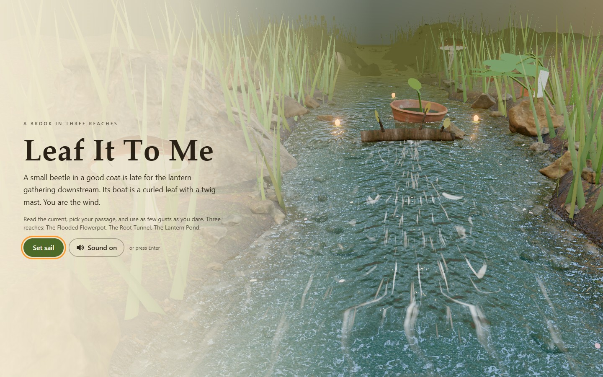
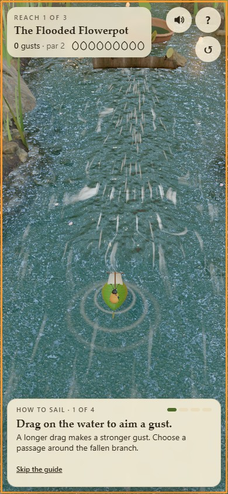
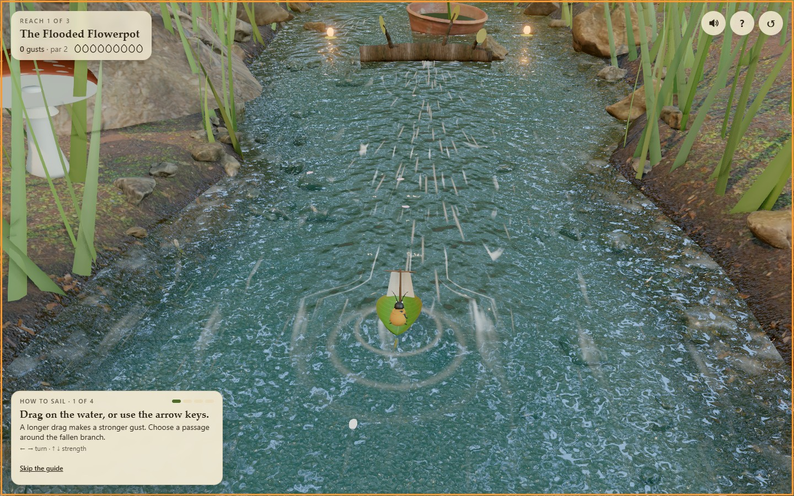

# LEAF IT TO ME

<p align="center"></p>

A beetle, a curled-leaf boat and three reaches of a miniature brook. Aim a brief gust, fill the petal sail and let the current do some of the work. Read the foam, choose a passage and arrive at the lantern gathering with as few puffs as possible.

**[Set sail →](https://08-leaf-it-to-me.williamking.workers.dev)** · [Run locally](#run-locally) · [Credits](#credits)

<p align="center"></p>

## A small gust goes a long way

**Set sail** moves the opening camera from the brook down to the boat. The four-step guide waits for your first aim and gust before explaining the current and stars. Help can be replayed, and later instructions reflect the reach you are sailing.

| Action | Pointer or touch | Keyboard |
| --- | --- | --- |
| Aim | Drag in the direction you want to blow | Left/Right |
| Set strength | Drag farther | Up/Down |
| Blow | Release | Space or Enter |
| Cancel | Return to the drag's starting point | Escape |
| Help / restart | Help and restart controls | Tab to the controls |
| Toggle sound | Sound | M |

Time slows while you aim. The dotted three-second preview includes the current and gust cooldown. Long foam streaks indicate fast flow; curling ones show eddies. Clover, roots and reeds create wind shadows, so the same gust can work differently a little farther along the bank. A very strong gust spills wind from the sail and sprays the beetle.

## Choose your passage

The **Flooded Flowerpot**, **Root Tunnel** and **Lantern Pond** each have two routes: a fast channel or sheltered lane, a passage beneath the root or around it, and a pond gyre or direct crossing. Par is two gusts per reach. Best stars are saved locally; a duck returns a stranded boat to a calm pool at a cost of two gusts.

The scene uses scanned CC0 surfaces, a moving water surface, foam and petals that follow the same authored flow field as the simulation. The leaf bends and heels around its twig mast, while the beetle reacts to spray. Sound combines water, wind, movement cues and the final gathering.

## Engineering and verification

Fixed-step sailing and preview use the same rules. Fractional time, collisions, rescue settlement and cooldown are tested explicitly. Pointer ownership survives camera motion, canceled drags, resize, blur and hidden tabs. Adaptive rendering and prepared shaders limit frame cost; the first successful draw gates the opening.

Application revision `ed83285` passed **82 tests / 501 assertions**, ten RTX 2060 scenarios and five final-build regressions. Both complete route branches, all three reaches, rescue, ending/replay, compact touch layouts and recovery are covered. See the [bug-pass report](docs/visual/BUG-PASS-2026-09-30.md).

Browse [src/game/](src/game/) for flow and sailing rules, [src/scene/](src/scene/) for the brook and boat, [src/ui/](src/ui/) for guides and controls, and [src/audio/](src/audio/) for the sound mix.

## Current screenshots

| Desktop | Phone |
| --- | --- |
|  |  |



The opening loop and three main screenshots were captured from the live site on **1 October 2026**, using Chrome on this workstation; the phone image is a 390 × 844 browser viewport. The animated preview is a short loop, not a full playthrough. [Capture details](docs/readme/capture.json).

## Run locally

Use **Bun 1.3.10** (the version pinned in `package.json`) and Node.js 22.12 or newer. From this repository:

```sh
bun install --frozen-lockfile
bun run dev      # http://127.0.0.1:4518/
bun run check    # strict types, Biome, unit tests and production build
bun run preview  # http://127.0.0.1:4618/ after the build
```

Development and preview are separate long-running commands; run one at a time or use separate terminals. `bun run build` writes the static production output to `dist/`. Dependencies and the lockfile are local to this project.

### Browser suite

Install the test browser once, then run the checked-in Playwright suite. Its configuration builds and starts the production preview. Browser scenarios are separate from `bun run check`.

```sh
bunx playwright install chromium
bun run e2e
```

The recorded real-GPU release checks used installed Chrome on an RTX 2060; the default Chromium configuration is not a claim of physical-phone coverage.

## Stack and release

Direct Three.js 0.186 · React 19.3 · strict TypeScript · Vite 8.3 · GSAP 3.15 · Tailwind CSS 4.3 · Bun 1.3.10 · Biome. The public website is served by Cloudflare Workers. This README describes [application revision ed83285](https://github.com/WilliamHenryKing/08-leaf-it-to-me/commit/ed83285b5a8541d4992e6c033537113007bba855); the documentation refresh changes no application behaviour.

## Credits

The type uses system font stacks. Every shipped file is listed with its source, author, licence, retrieval date, sha256 and processing in [`assets.manifest.json`](assets.manifest.json) (about 9.8 MB in total).

### Visuals

The brook's environment light, ground, stones, bark and flowerpot are CC0 scans and textures from [Poly Haven](https://polyhaven.com), processed with gltf-transform (meshopt, WebP) and Pillow. The leaf boat, beetle, duck, toadstools, clover, reeds, grass, lily pads and effects are modelled and textured procedurally in code.

| File(s) | Used for | Source | Author | Licence |
| --- | --- | --- | --- | --- |
| `env/river_walk_1_1k.hdr` | Environment light, reflections and sky (reaches 1–2) | [Source](https://polyhaven.com/a/river_walk_1) | Greg Zaal | CC0 |
| `env/sunset_forest_1k.hdr` | Dusk environment at the Lantern Pond | [Source](https://polyhaven.com/a/sunset_forest) | Andreas Mischok | CC0 |
| `textures/clean_pebbles/*` | The river bed | [Source](https://polyhaven.com/a/clean_pebbles) | Rob Tuytel | CC0 |
| `textures/mud_forest/*` | Wet mud at the waterline, the tunnel overhang | [Source](https://polyhaven.com/a/mud_forest) | Rob Tuytel | CC0 |
| `textures/brown_mud_leaves_01/*` | Mossy leaf litter on the banks | [Source](https://polyhaven.com/a/brown_mud_leaves_01) | Rob Tuytel | CC0 |
| `textures/bark_brown_02/*` | The branch, roots and raft | [Source](https://polyhaven.com/a/bark_brown_02) | Rob Tuytel | CC0 |
| `models/rock_moss_set_01*.glb` | Rocks in the water, bank boulders | [Source](https://polyhaven.com/a/rock_moss_set_01) | Kless Gyzen | CC0 |
| `models/rock_moss_set_02_lod.glb` | Pebbles on the bed and waterline | [Source](https://polyhaven.com/a/rock_moss_set_02) | Kless Gyzen | CC0 |
| `models/planter_pot_clay.glb` | The flooded flowerpot | [Source](https://polyhaven.com/a/planter_pot_clay) | Amal Kumar | CC0 |
| `models/tree_stump_01.glb` | Mossy stumps on the banks | [Source](https://polyhaven.com/a/tree_stump_01) | Rob Tuytel | CC0 |

The rendering approach (post-processing chain, HDRI environment, Fresnel water over a visible bed) was adapted from William King's earlier collection project ODD TIDE, with his permission.

### Audio

Sound starts on the first tap, click or key press. Music and ambience loop in code with crossfades. Everything was trimmed, mixed to mono and re-encoded as MP3 (about 1.1 MB in total) in `public/audio/`. Every source is **CC0 (public domain)**; credit is given as thanks, not as a requirement.

| File | Used for | Source | Author | Licence |
| --- | --- | --- | --- | --- |
| `music.mp3` | Music (first 105 s of "Sunset Plains") | [Source](https://opengameart.org/content/sunset-plains) | yoiyami | CC0 |
| `river.mp3` | Brook ambience (excerpt of `park_ambience_river.wav`) | [Source](https://opengameart.org/content/park-ambiences) | thimras | CC0 |
| `birds.mp3` | Birdsong ambience (excerpt of `park_ambience_birds.wav`) | [Source](https://opengameart.org/content/park-ambiences) | thimras | CC0 |
| `splash-small.mp3`, `splash-big.mp3` | Bumps, spills, the duck setting the boat down (`splash_10`, `splash_07`) | [Source](https://opengameart.org/content/40-cc0-water-splash-slime-sfx) | rubberduck | CC0 |
| `sail.mp3` | The sail filling on each gust (`cloth1`) | [Source](https://kenney.nl/assets/rpg-audio) | Kenney (kenney.nl) | CC0 |
| `bump.mp3` | Hitting wood or stone (`impactWood_light_001`) | [Source](https://kenney.nl/assets/impact-sounds) | Kenney (kenney.nl) | CC0 |
| `lantern.mp3`, `click.mp3`, `toggle.mp3`, `aim.mp3` | Lantern gathered, buttons, mute, start of aiming (`glass_004`, `click_001`, `toggle_001`, `pluck_002`) | [Source](https://kenney.nl/assets/interface-sounds) | Kenney (kenney.nl) | CC0 |
| `checkpoint.mp3`, `finish.mp3` | New reach, arrival at the gathering (`jingles_PIZZI07`, `jingles_STEEL02`) | [Source](https://kenney.nl/assets/music-jingles) | Kenney (kenney.nl) | CC0 |

The gust's rush of air and the duck's quack are synthesized live with the Web Audio API (`src/audio/audio.ts`). No CC0 quack recording could be found.

---

Part of [William King's portfolio collection](https://github.com/WilliamHenryKing).
