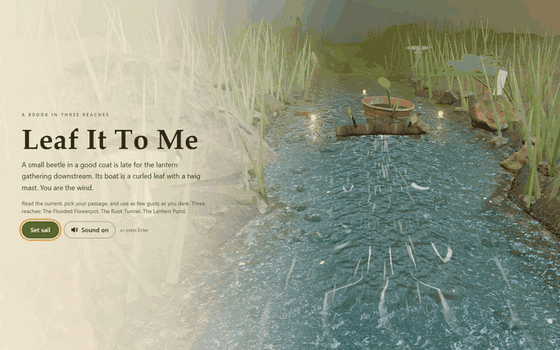
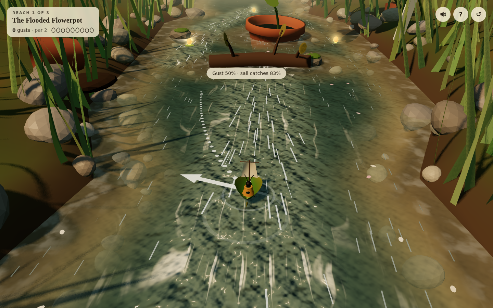
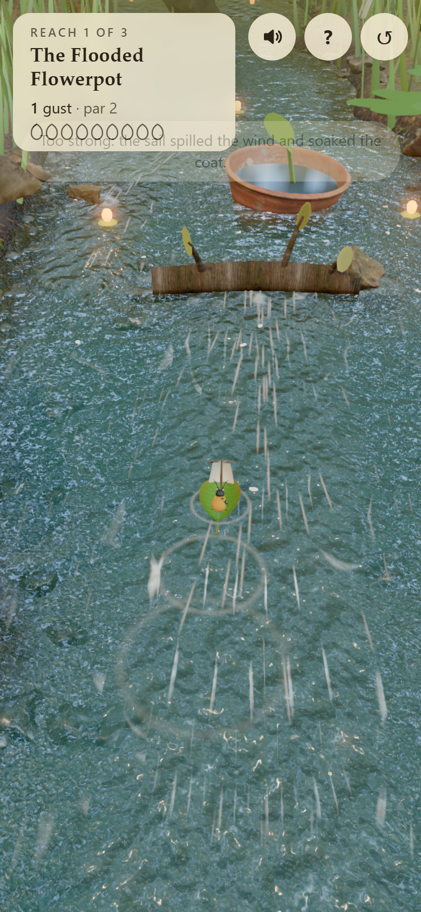

<div align="center">



<br />

<a href="https://08-leaf-it-to-me.williamking.workers.dev"></a>


<h3>A miniature river adventure where you are the wind: read the current, pick your passage, and blow a beetle in a good coat all the way to the lantern gathering.</h3>



</div>

## How to play

Nudge a curled-leaf boat down three reaches of one brook (the **Flooded Flowerpot**, the **Root Tunnel** and the **Lantern Pond**) using nothing but brief gusts of wind.

| Action | Touch / mouse | Keyboard |
| --- | --- | --- |
| Aim a gust | Drag anywhere: the gust blows the way you drag | `←` `→` turn the gust |
| Set its strength | Drag further for a stronger gust | `↑` `↓` |
| Blow | Let go | `Space` or `Enter` |
| Cancel an aim | Drag back to where you started | `Esc` |
| Mute / unmute | Speaker button | `M` |
| Controls again / restart | `?` / `↺` buttons | |

- **Time slows while you aim**, and a dotted line previews the next three seconds, including gust cooldown. Drag on the water; return to the starting point or cancel the drag to keep sailing without a gust.
- **Read the water.** Long, bright foam streaks mean fast water, faint ones slack water, and curling lines an eddy. Clear shallows show the gravel bed, and shade under clover, roots and reeds is a **wind shadow**, where gusts barely reach the sail.
- **Stronger isn't always better.** A gust from behind fills the petal sail best; past about 70% the sail spills the wind and soaks the beetle.
- **Every reach has two passages**: the fast chute or the sheltered lane past the flowerpot; under the root or round the outside; the pond's gyre or straight across to the gathering.
- The skippable opening holds the boat until the camera arrives. The four-step guide waits for your first aim and gust, then explains the current and stars. `?` replays help for the current reach.
- **Par is 2 gusts per reach.** Beat it for ★★★, and your best stars are saved in your browser. Get stuck and a duck carries you back to the last calm pool, but it costs you two gusts.

## What's inside

- 🌊 **A current you can read**: hundreds of foam streaks and petals ride the same authored flow field the physics uses, so what you see is what moves the boat.
- 🍃 **A leaf boat with momentum**: a curled leaf, twig mast and petal sail that heels, billows and spills wind, with a beetle in a coat who shakes off the spray.
- 🪴 **Three places, one brook**: a flooded flowerpot and a fallen branch, a dim root tunnel with shafts of light, and a warm lantern pond at dusk with fireflies and a crowd of bugs waiting on the raft.
- 🦆 **Gentle failure**: stuck against a root? A very large duck lifts you back to the last calm pool, and you're sailing again in seconds.
- ⭐ **Par and stars** for each reach, a summary at the pond, and best results remembered.
- 🎧 **Sound design**: a CC0 music loop and brook ambience that follow where you are, sampled effects, and a gust and quack synthesized live in Web Audio.
- ♿ **Plays anywhere**: mouse, touch and keyboard, phone and desktop layouts, `prefers-reduced-motion` respected, and persistent mute.

## Screenshots

<table>
  <tr>
    <td width="72%"></td>
    <td width="28%"></td>
  </tr>
  <tr>
    <td align="center">Desktop, 1440 × 900</td>
    <td align="center">Phone, 390 × 844</td>
  </tr>
</table>

## Built with

**three.js** (no React Three Fiber), **React 19** for the HUD, strict **TypeScript**, **Vite**, **GSAP**, **Tailwind CSS v4**, **Biome** and **Bun**, with **Playwright** for the end-to-end test. Rendering: AgX tone mapping applied once in an `OutputPass`, a CC0 river HDRI as image-based light, GTAO, thresholded bloom and SMAA, with a lighter tier for phones.

Notable techniques:

- **Authored current and wind fields.** The brook is data: jets, eddies, calm pools and wind shadows blended into a single `currentAt(x, y)` and `windAt(x, y)` (`src/game/field.ts`). The same field drives the physics, the dotted route preview, the drifting foam streaks and a baked flow map in the water shader, so the water always tells the truth.
- **A leaf-boat simulation you can predict.** Fixed-step drag towards the current, momentum, sail efficiency by gust angle, spill above 70%, collisions and stranding are all pure TypeScript (`src/game/sim.ts`). A cloned-state `predict()` draws the route before you commit, and unit tests sail both passages of the first two reaches and the finish at the pond.
- **A flow-mapped water shader.** A patched `MeshStandardMaterial` advects two cross-faded ripple phases and flow-aligned foam along the baked current. It turns see-through in the shallows, and shade and warmth ease with each place.

## Run it locally

```sh
bun install
bun run dev      # http://127.0.0.1:4518/
bun run check    # strict tsc, Biome, bun test, production build into dist/
bun run e2e      # both full routes, rescue/replay, touch/input and loading recovery
```

Layout: `src/game/` pure rules, course data and scoring (unit-tested in `tests/`); `src/scene/` the three.js world, effects and input; `src/audio/` sound; `src/ui/` the React HUD; `src/play.ts` and `src/main.tsx` the wiring; `e2e/` the end-to-end test.

## Credits

The type uses system font stacks. Every shipped file is listed with its source, author, licence, retrieval date, sha256 and processing in [`assets.manifest.json`](assets.manifest.json) (about 9.8 MB in total).

### Visuals

The brook's environment light, ground, stones, bark and flowerpot are CC0 scans and textures from [Poly Haven](https://polyhaven.com), processed with gltf-transform (meshopt, WebP) and Pillow. The leaf boat, beetle, duck, toadstools, clover, reeds, grass, lily pads and effects are modelled and textured procedurally in code.

| File(s) | Used for | Source | Author | Licence |
| --- | --- | --- | --- | --- |
| `env/river_walk_1_1k.hdr` | Environment light, reflections and sky (reaches 1–2) | https://polyhaven.com/a/river_walk_1 | Greg Zaal | CC0 |
| `env/sunset_forest_1k.hdr` | Dusk environment at the Lantern Pond | https://polyhaven.com/a/sunset_forest | Andreas Mischok | CC0 |
| `textures/clean_pebbles/*` | The river bed | https://polyhaven.com/a/clean_pebbles | Rob Tuytel | CC0 |
| `textures/mud_forest/*` | Wet mud at the waterline, the tunnel overhang | https://polyhaven.com/a/mud_forest | Rob Tuytel | CC0 |
| `textures/brown_mud_leaves_01/*` | Mossy leaf litter on the banks | https://polyhaven.com/a/brown_mud_leaves_01 | Rob Tuytel | CC0 |
| `textures/bark_brown_02/*` | The branch, roots and raft | https://polyhaven.com/a/bark_brown_02 | Rob Tuytel | CC0 |
| `models/rock_moss_set_01*.glb` | Rocks in the water, bank boulders | https://polyhaven.com/a/rock_moss_set_01 | Kless Gyzen | CC0 |
| `models/rock_moss_set_02_lod.glb` | Pebbles on the bed and waterline | https://polyhaven.com/a/rock_moss_set_02 | Kless Gyzen | CC0 |
| `models/planter_pot_clay.glb` | The flooded flowerpot | https://polyhaven.com/a/planter_pot_clay | Amal Kumar | CC0 |
| `models/tree_stump_01.glb` | Mossy stumps on the banks | https://polyhaven.com/a/tree_stump_01 | Rob Tuytel | CC0 |

The rendering approach (post-processing chain, HDRI environment, Fresnel water over a visible bed) was adapted from William King's earlier collection project ODD TIDE, with his permission.

### Audio

Sound starts on the first tap, click or key press. Music and ambience loop in code with crossfades. Everything was trimmed, mixed to mono and re-encoded as MP3 (about 1.1 MB in total) in `public/audio/`. Every source is **CC0 (public domain)**; credit is given as thanks, not as a requirement.

| File | Used for | Source | Author | Licence |
| --- | --- | --- | --- | --- |
| `music.mp3` | Music (first 105 s of "Sunset Plains") | https://opengameart.org/content/sunset-plains | yoiyami | CC0 |
| `river.mp3` | Brook ambience (excerpt of `park_ambience_river.wav`) | https://opengameart.org/content/park-ambiences | thimras | CC0 |
| `birds.mp3` | Birdsong ambience (excerpt of `park_ambience_birds.wav`) | https://opengameart.org/content/park-ambiences | thimras | CC0 |
| `splash-small.mp3`, `splash-big.mp3` | Bumps, spills, the duck setting the boat down (`splash_10`, `splash_07`) | https://opengameart.org/content/40-cc0-water-splash-slime-sfx | rubberduck | CC0 |
| `sail.mp3` | The sail filling on each gust (`cloth1`) | https://kenney.nl/assets/rpg-audio | Kenney (kenney.nl) | CC0 |
| `bump.mp3` | Hitting wood or stone (`impactWood_light_001`) | https://kenney.nl/assets/impact-sounds | Kenney (kenney.nl) | CC0 |
| `lantern.mp3`, `click.mp3`, `toggle.mp3`, `aim.mp3` | Lantern gathered, buttons, mute, start of aiming (`glass_004`, `click_001`, `toggle_001`, `pluck_002`) | https://kenney.nl/assets/interface-sounds | Kenney (kenney.nl) | CC0 |
| `checkpoint.mp3`, `finish.mp3` | New reach, arrival at the gathering (`jingles_PIZZI07`, `jingles_STEEL02`) | https://kenney.nl/assets/music-jingles | Kenney (kenney.nl) | CC0 |

The gust's rush of air and the duck's quack are synthesized live with the Web Audio API (`src/audio/audio.ts`). No CC0 quack recording could be found.

---

<p align="center"><sub>Part of William King's portfolio collection.</sub></p>
